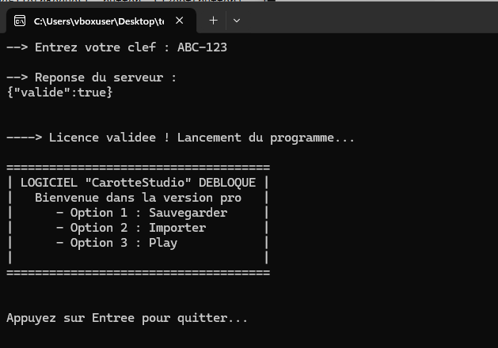
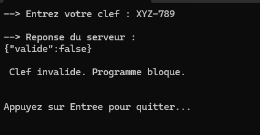
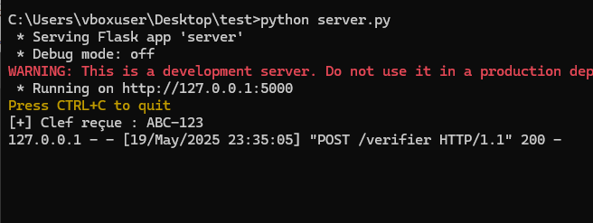
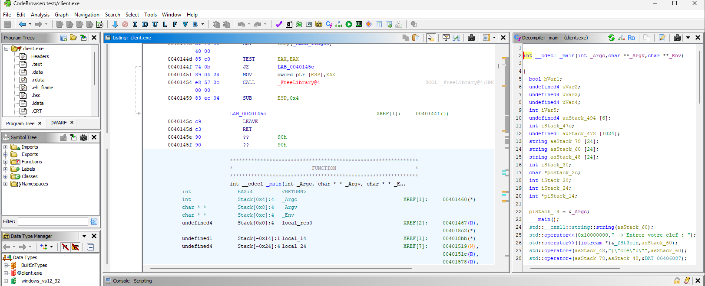
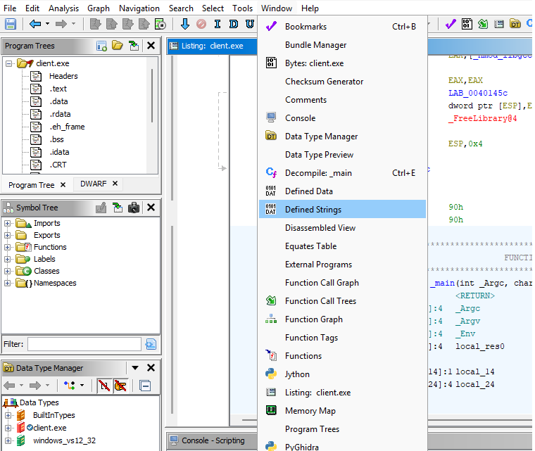
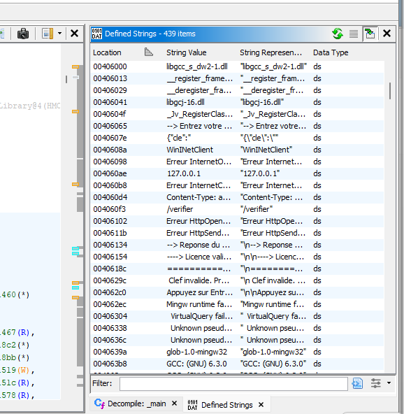
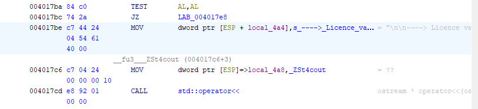
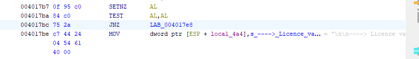
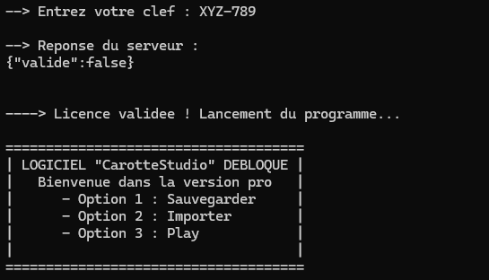

# 🛠️ Simulation d'un "crack" de logiciel sous licence avec du Reverse Engineering

## 🎯 But pédagogique

Cette expérience permet de mieux comprendre comment des individus parviennent à **frauder la gestion des licences** dans certains logiciels très connus comme FL Studio par exemple.

⚠️ **Ceci est une simulation**, il ne s'agit bien sûr pas de promouvoir ce genre d’acte mais uniquement d’en comprendre les techniques à des fins éducatives.

---

## 📘 Contexte

Un bon nombre de logiciels utilisent en "hors-ligne", directement un **système de clé d’activation** permettant de valider une licence d’un utilisateur et de lui permettre d’accéder au contenu du logiciel.

Cela permet de s’assurer que les utilisateurs ont bien payé leur licence puisque cette dernière sera vérifiée par le système.

📌 En pratique, il est possible de détourner ce système en altérant le code de l’exécutable, c’est ce qu’on appelle le **reverse engineering**.

En effet, si le client sur la machine locale nécessite une validation du côté serveur, il est alors possible de couper cette logique en modifiant légèrement afin d’avoir directement accès au logiciel **librement**, **sans payer** (c’est bien évidemment illégal).

---

## 🧰 Outils utilisés pour cette expérience

- **Client en C++** avec la **librairie wininet** : pour simuler l'application à "cracker"
- **Serveur en Python avec Flask** : pour simuler la validation à distance de la clé
- **Ghidra** : pour analyser le code en assembleur de l’exécutable du logiciel

---

## 🎥 Démonstration

Tout d’abord, j’ai créé un client en C++ qui demande d’entrer la clé d’activation à l’utilisateur. Il envoie ensuite la requête via HTTP local sur le port 5000 au serveur Flask écrit en Python.

Le serveur Flask vérifie la clé et renvoie une réponse (`valide: true` ou `valide: false`).

Ensuite, le client détecte cette réponse :

- Si la clé est **erronée**, le programme bloque l’accès.
- Si elle est **correcte**, le logiciel est lancé.
- 
  

    
---

## 🧠 Analyse avec Ghidra

J’importe l’exécutable du client dans Ghidra pour effectuer une **analyse statique**.

  

- Ghidra permet de voir le code assembleur, les chaînes de caractères et les adresses utilisées.
- En C++, les chaînes comme "Licence validée" sont souvent **en mémoire statique** : il suffit donc de les repérer pour **identifier la logique du programme**.

Sur Ghidra, on utilise :
- **Window > Defined Strings** : pour repérer les chaînes
- Les **XREF** (cross-references) : pour remonter au bloc assembleur principal
  

    

En suivant le flux, on arrive à une instruction assembleur **JZ (Jump if Zero)** qui indique un **test de validation**.

  

---

## ✏️ Modification

On modifie l’instruction **JZ** par **JNZ** (Jump if Not Zero), ce qui inverse la logique :

  

- Le programme s’exécutera **même si la clé est invalide**

Une fois le binaire recompilé, le logiciel lance bien l’interface complète sans vérification réelle de la clé.

  

---

## 🚧 Limitation de la technique

Même si cette méthode d’analyse est **rapide et efficace** sur des exécutables simples :

- Elle atteint ses limites face à des protections plus poussées :  
  - **Obfuscation**  
  - **Chaînes dynamiques**  
  - **Anti-debug**, etc.

- Certaines protections empêchent même Ghidra ou IDA de lire le binaire correctement
- Les chaînes peuvent être **chiffrées ou reconstruites dynamiquement**

Ce type de reverse ne fonctionne donc **pleinement que sur des exécutables non protégés**, ce qui est souvent le cas **dans un contexte pédagogique ou de test**.

---

👉 **N'hésitez pas à me suivre pour plus de contenu du genre**  
📬 Et à me contacter pour des opportunités professionnelles ou des projets liés au reverse engineering et à la cybersécurité.

---